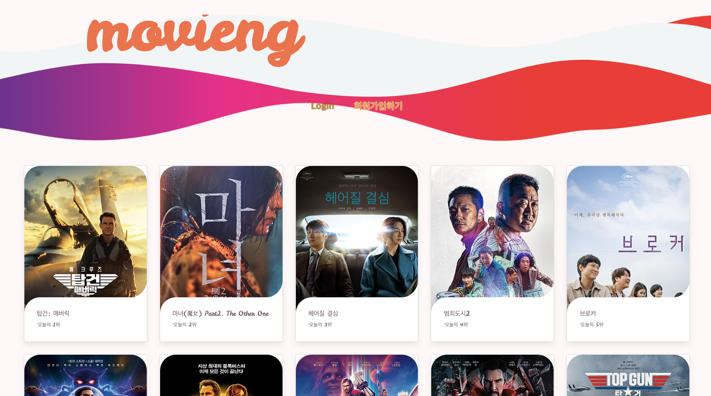

---
#### 항해99 사전스터디 3조
# Movieng - 무비랭킹
---

## [시연영상 바로가기](https://www.youtube.com/watch?v=qbDI9jdoRqI)

## 1. 프로젝트 소개

Movieng은 네이버 영화 랭킹을 기반으로 1위부터 50위까지의 영화를 카드로 보여줍니다.
댓글로 자유롭게 의견을 나눌 수 있는 작은 영화정보 사이트입니다.

## 2. 팀 소개

- 전지만(팀장): 1) 로그인, 회원가입 페이지 작성, 2) JWT 로그인 방식 구현 3)웹페이지 SSL인증서 적용 4)메인페이지 작성
- 김도우: 1) 영화페이지 뼈대구현 2) 영화페이지 사진,코멘트 3) ajax 구현
- 김수환: 1) 영화페이지 작성 2)영화별 코멘트 기능 구현 3)영화페이지 CSS Container 적용
- 이창현: 1) 로그인, 회원가입 페이지 작성 2) 댓글 페이징 방식 구현
- 조현우: 1) 영화페이지 뼈대구현

## 3. 작업 기간

- 2022년 6월 23일 ~ 2022년 7월 1일 (총 9일)

## 4. 사용 기술

`Back-end`

- Python
- Flask
- MongoDB
- BS4
- JWT
- Apscheduler

`Front-end`

- JQuery
- Bootstrap
- Jinja2
- Javascript

## 5. 구현 기능

- 메인 페이지  
  : 스케쥴러를 통한 네이버 영화 URL 등록  
  : 등록된 URL로 네이버 영화 크롤링(장르, 포스터, 제목, 설명)  
  : DB에 저장된 영화 카드 형식으로 리스트업  
  : 로그인 및 회원가입 페이지 리디렉션

- 상세 페이지  
  : 리뷰 등록(영화ID, 작성자, 리뷰)  
  : DB에 저장된 리뷰 리스트업

- 로그인 페이지  
  : 비밀번호 해시값 확인 및 토큰 부여

- 회원가입 페이지  
  : 아이디 중복 확인  
  : 아이디, 비밀번호 양식 확인  
  : 비밀번호 일치 확인  
  : 회원정보 등록(아이디, 비밀번호 해시값)

## 6. Troubleshooting

- Token 외 추가된 쿠키가 로그인 검증 시 검출  
  : match함수가 아닌 find함수로 null체크로 검증방식 변경
- Card list 로딩으로 인한 지연출력
  : card page를 두가지 function을 통해 출력하던 방식에서 card element에 내부기능만 바꿔서 출력토록 수정
  (1.6초에서 0.8초로 로딩시간 단축)
- Python, HTML, CSS에 익숙하지 않아 발생한 수많은 오류  
  : Google로 해결
